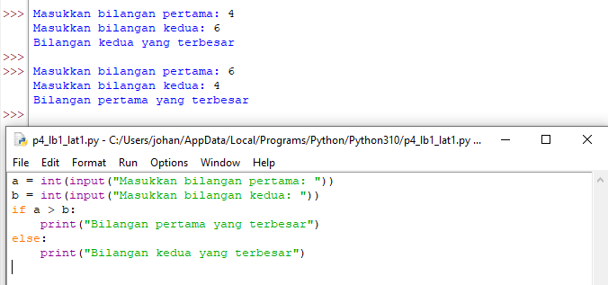
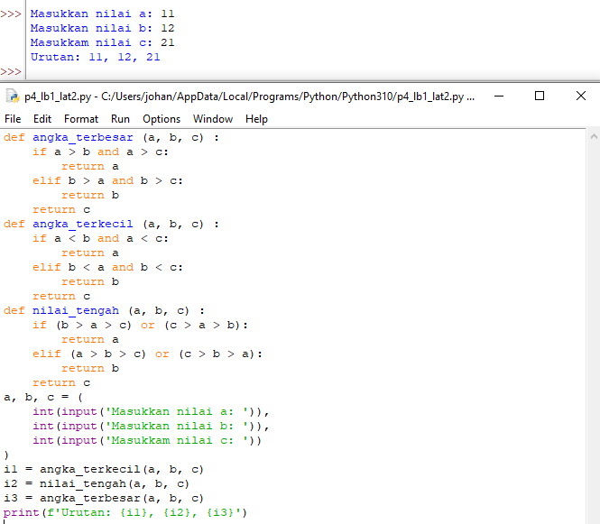
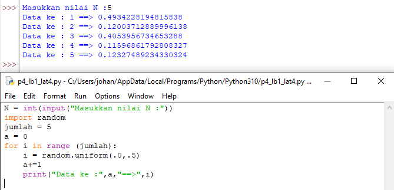
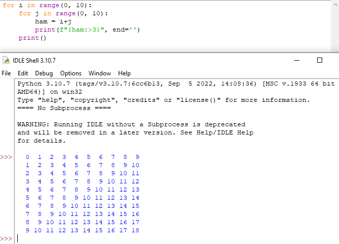

 # Praktikum 4
 ## Lab 2
 ### Latihan 1
 
 #### Buat program sederhana dengan input 2 buah bilangan, kemudian tentukan bilangan terbesar dari kedua bilangan tersebut menggunakan statement if.
 
 
 
 ### Latihan 2
 #### Buat program untuk mengurutkan data berdasarkan input sejumlah data (minimal 3 vaiabel input atau lebih), kemudian tampilkan hasilnya secara berurutan mulai dari data terkecil.

## Lab 3
### Latihan 1

#### Buat program dengan perulangan bertingkat (nested) for yang menghasilkan output sebagai berikut.

### Latihan 2

#### - Tampilkan n bilangan acak yang lebih kecil dari 0.5.
#### - Nilai n diisi pada saat runtime.
#### - Anda bisa menggunakan kombinasi while dan for untuk menyelesaikannya.

